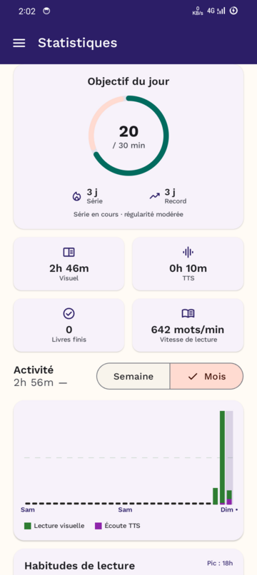

*[Français](README.md) · **English***

# InkTone

**An Android ebook reader with neural text-to-speech that highlights every word as it is spoken — and works entirely offline.**

[](https://github.com/issa14/InkTone/actions/workflows/ci.yml)
[](LICENSE)
[](#requirements)
[](https://kotlinlang.org)

<p align="center">
  
  <br>
  <em>The highlight follows the voice, word by word.</em>
</p>

| Library | Reading | Narration | Statistics |
|:---:|:---:|:---:|:---:|
|  |  |  |  |

---

## What it is

InkTone reads your ebooks — EPUB, PDF, plain text — and reads them **out loud**, with a neural voice running on the device and a highlight that stays in step with it, word by word.

Everything works without a connection: importing, reading, speech synthesis. Online services exist, but they are optional and off by default.

The project is built French-first — voices, interface, sentence segmentation.

## Features

**Read**
- EPUB, PDF and plain text, imported from any folder on the device
- Continuous scrolling or paged mode
- Adjustable text size, line height, margins, typeface and reading theme
- Reader-only brightness, independent of the system setting
- Bookmarks, annotations and highlights, full-text search, table of contents

**Listen**
- On-device neural synthesis (Sherpa-ONNX) with **per-word timestamps**, so the highlight is genuinely synchronised — never interpolated
- Android system voices as a fallback; an optional cloud engine for those who enable it
- Adjustable speed, pitch and gain; custom pronunciation rules
- Narration continues with the screen off, controllable from the notification and the lock screen
- Sleep timer

**Organise**
- Series, tags, favourites, pinning
- Filters, sorting and three display layouts
- OPDS catalogues to discover and import new books

**Track**
- Visual reading time and listening time counted separately
- Day streak, daily goal, hourly activity map
- Reading speed, per-book statistics, CSV and JSON export

**Comfort**
- Eye-rest reminder
- An accessibility preset that adjusts size, layout and contrast in one move
- Local backup and restore; optional Google Drive sync

## Installation

**No binary release has been published yet.** Version 1.0.0 is in preparation; there is no Releases page and no Play Store listing for now.

In the meantime, see [Building from source](#building-from-source).

### Requirements

| | |
|---|---|
| Android | 8.0 (API 26) or later |
| CPU | **`arm64-v8a` only** — the native speech code is built for that architecture alone. 32-bit devices and x86 emulators are not supported. |
| Storage | ~65 MB for the app, plus any neural voices downloaded separately |
| Connection | needed only to download a voice, browse an OPDS catalogue, or sync |

## Voices and models

Speech models are **not bundled with the app**: they are downloaded on demand from the settings screen ([ADR-018](docs/adr/ADR-018-voice-model-distribution.md)). The app remains usable without them, using Android's system voice.

Their licences are separate from the code's and **apply to any redistribution**:

| Model | Role | Licence |
|---|---|---|
| `fr_FR-upmc-medium` (Piper VITS) | French speech synthesis | **CC-BY-SA-4.0** |
| NeMo FastConformer CTC (NVIDIA) | forced alignment for word-level timing | **CC-BY-4.0**, attribution required |

If you distribute a build of InkTone, these obligations are yours. The reasoning behind these models — and the documented rejection of alternatives with disqualifying licences — is in [ADR-022](docs/adr/ADR-022-kokoro-tts-engine-piper-alternatives-rejected.md).

## Privacy

- **Nothing leaves the device by default.** Speech synthesis, reading and importing are all local.
- **No blanket storage access.** Files go exclusively through the Storage Access Framework; the `MANAGE_EXTERNAL_STORAGE` permission is absent, and CI checks that on every commit.
- **Crash reporting is opt-in**, and a no-op when no configuration is supplied.
- **Online services are optional and disabled**: sync, OPDS catalogues, cloud voices.

The **local backup is end-to-end encrypted**: AES/GCM with a key derived through PBKDF2 from a password only you know. It is stored nowhere — **a lost password makes the backup permanently unreadable**, including to you.

A full account of what is collected, sent and stored is in the [privacy policy](PRIVACY.md) (in French).

## Project status

Version `1.0.0` is in preparation and has never been published. Every feature listed above is implemented and verified on a device; none is a stub.

Known and accepted open points:

- **Instrumented tests do not run in CI.** Room migrations, DAOs and Compose accessibility require an emulator or a physical device; they are run and verified manually before every sensitive merge. CI covers the build, JVM tests, architecture rules and the regression guards.
- **The Edge-TTS cloud engine relies on an unofficial Microsoft API** ([ADR-024](docs/adr/ADR-024-edge-tts-optional-cloud-engine.md)). Disabled by default, it may stop working without notice.

This repository enforces a strict rule: no document claims a feature is finished without the commit, file or test that proves it. To find out where things actually stand, read `docs/execution/` and `git log` — never a summary.

## Building from source

> **Do this first.** `app/libs/sherpa-onnx-1.13.4.aar` is required to build but **is not versioned**. Fetch it from the [sherpa-onnx](https://github.com/k2-fsa/sherpa-onnx) project artefacts and drop it at that path, or the build fails immediately.

```bash
git clone https://github.com/issa14/InkTone.git
cd InkTone
# drop app/libs/sherpa-onnx-1.13.4.aar in place (see above)
./gradlew build          # compile, unit tests, architecture rules
./gradlew :app:installDebug
```

JDK 17 required.

`google-services.json` (crash reporting) and `local.properties` (sync OAuth) are optional: without them the build stays green and the matching features disable themselves cleanly.

Useful commands:

```bash
./gradlew :domain:test                            # domain tests only
./gradlew :<module>:checkArchitectureRules        # one module's rules
bash scripts/check-no-emoji.sh                    # iconography guard
bash scripts/check-no-manage-external-storage.sh  # permissions guard
```

## Architecture

Multi-module Clean Architecture, MVI presentation, one immutable state per screen.

```
Presentation → Application → Domain ← Data ← Infrastructure
```

The `domain` module depends on neither Android, nor Room, nor Compose, nor any other module in the project. **This is not a review convention: every module applies a plugin that wires `checkArchitectureRules`, and a forbidden dependency fails `./gradlew build`.**

Stack: Kotlin, Jetpack Compose (Material 3), Readium, Sherpa-ONNX / ONNX Runtime through JNI, Room, Hilt, Media3.

The details — module breakdown, domain model, TTS pipeline — live in the Blueprint, which is authoritative. It is deliberately not summarised here: two sources would eventually diverge.

## Documentation

Project documentation is written in French.

| For | Go to |
|---|---|
| The target architecture, chapter by chapter | [`docs/blueprint/`](docs/blueprint/) |
| Architecture decisions and the alternatives ruled out | [`docs/adr/`](docs/adr/) |
| Actual progress, plans and acceptance criteria | [`docs/execution/`](docs/execution/) |
| Contribution conventions | [CONTRIBUTING.md](CONTRIBUTING.md) |
| What each version brings | [CHANGELOG.md](CHANGELOG.md) |
| How data is handled | [PRIVACY.md](PRIVACY.md) |

## Contributing

Read [CONTRIBUTING.md](CONTRIBUTING.md) before opening a pull request. The essentials:

- Commit messages **in French, imperative mood** (`Corrige…`, `Ajoute…`).
- Every architecture decision goes through an **ADR** in `docs/adr/` — never deleted; a superseded ADR moves to `Superseded` status.
- Every Room migration ships with its test **in the same commit**.
- `./gradlew build` must stay green: it includes the architecture rules.

## Licences

InkTone's code is distributed under the **MIT licence** (see [LICENSE](LICENSE) and [ADR-026](docs/adr/ADR-026-licence-mit-ouverture-du-code.md)).

**Not** covered by that licence: the sherpa-onnx Kotlin bindings (Apache-2.0), the icon sets (Material Symbols under Apache-2.0, Lucide under ISC), and the speech models downloaded at runtime, whose attribution and share-alike obligations apply to any distribution.

The full detail is in [THIRD_PARTY_NOTICES.md](THIRD_PARTY_NOTICES.md) — **read it before redistributing**.
